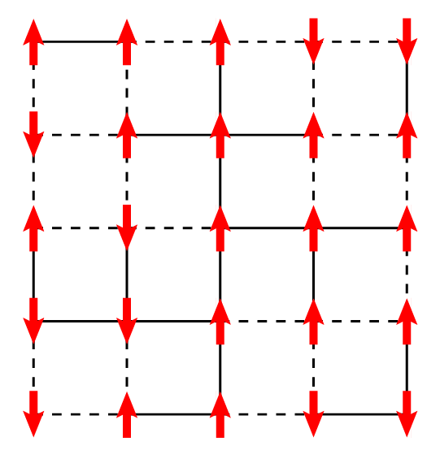
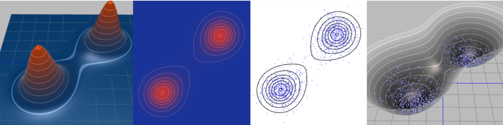

# Hopfield Network

# Spin Glass

## Ising Model

Spin glass model starts from Ising model to study the magnetic properties of ferromagnetic materials from a statistical mechanics perspective. The model is a simple lattice model, in the following picture is a 2D square lattice with $N=5\times 5$ sites. On each lattice site $i$ there is an atom, represented by a spin variable $s_i = \pm 1$ (red arrows pointing up or down). 

In statistical mechanics, to study the properties of a system, one needs to start from the energy of states of a system. In the Ising model, we mainly focus on two components of the energy function: the interaction energy between spins, and the external magnetic field. The energy function of the Ising model is thus given by:

$$
\begin{aligned}
    E(s) = -\sum_{i,j}w_{ij}s_i s_j - h\sum_i s_i
\end{aligned}
$$ 
where $w_{ij}$ is the interaction strength between spins $i$ and $j$, and $h$ is the external magnetic field. In this case, technically speaking, once we know the values of $w_{ij}$ and $h$, we can have the exact solution of the model, but it turns out that when the model gets larger and larger, the exact solution becomes intractable. So in physics, we often apply some simplifications to the model, such as:

- **Mean-field Approximation**: each spin only 'feels' the average effect of all other spins;
- **Ising Model** on a regular lattice: we imagine the spins are on a regular lattice, and the interaction strength $w_{ij}$ only depends on the spacial relationship between spins $i$ and $j$. For example, in the above 2D square lattice, only neighboring spins interact with each other ($w_{ij}=w\neq 0$);
- **Sherrington-Kirkpatrick Model**: the interaction strength $w_{ij}$ is random, but following i.i.d. distribution (e.g. standard normal distribution, or uniform distribution).

But in our case, **Hopfield Network**, we use the most general form, the $w_{ij}$ matrix stores the *'memory'* of the network, and the (local) minima of the energy function are the *'memorized'* states. But as we stated before, the exact solution of the model is intractable, so some numerical methods are needed to solve the model. In this case we will find that the physical nature of the spin glass model provides lots of convenience.

### Statistical Mechanics, Boltzmann Distribution and Numerical Methods

In canonical ensemble, the probability of a state $s$ is given by the Boltzmann distribution. We put a short derivation in the Appendix, here we just state the result:
$$
\begin{aligned}
    p(s) = \frac{1}{Z}e^{-\beta E(s)},\quad Z = \sum_s e^{-\beta E(s)}
\end{aligned}
$$ 
in which the normalization factor $Z$ is called the partition function, and $\beta = 1/k_BT$ is the inverse temperature. The reason why there is a distribution is that: since there is always thermal fluctuation in the system, the system will not stay at *the* state with the lowest energy, but will fluctuate around it, which is what we call 'reaching an equilibrium', and Boltzmann distribution tells us *at equilibrium, the probability that a system stays in a state*.

Now if we examine the probability expression, we notice that when $\beta \to \infty$, i.e. when the temperature $T\to 0$, the probability of a state $s$ is dominated by the states with the lowest energy. That means, the system would tend to stay in the state with the lowest energy, especially at low temperature. 

To sample from the Boltzmann distribution, we have lots of methods, such as Metropolis-Hastings algorithm, Gibbs sampling, Hamiltonian Monte Carlo, etc. We are not going to detail all these methods here (an introduction to Gibbs sampling can be found in Appendix), but it's strongly recommended to look at figures in [this blog](https://arogozhnikov.github.io/2016/12/19/markov_chain_monte_carlo.html) to see how the system *'tends to stay in the state with the lowest energy'*. Here's a figure from the blog, in which each point is a sampled state from the Boltzmann distribution, you can see more samples are around the state with low energy.

The basic idea of these sampling methods is to wisely build a Markov chain and use the stationary distribution as the target distribution. Further, we can slowly drop the temperature in the process of sampling so that we have higher and higher probability around low energy states. This trick is called *annealing*.

### From Hopfield Network to Boltzmann Machine

Now we have the basic idea of the Boltzmann distribution and the sampling methods, we can see that when we view the Hopfield network as thermal system, the energy function of the network is exactly the energy function of the Ising model, and **we can apply the sampling methods of Boltzmann distribution of the Ising model to find the low energy states of the hopfield network**. In this sense, Boltzman machine is a stochastic version of Hopfield network.

As we mentioned before, we want to train a Hopfield network so that it memorizes target patterns while avoiding spurious states. In the context of the Ising model, we can view it as maximizing the likelihood that the network stays in the memorized states, i.e. $w_{ij}, h_{i}$ are chosen such that: 

$$
\begin{aligned}
    w_{ij}, h_{i}=\mathop{\arg\min}\limits_{w,h} \dfrac{ 1 }{ \left\vert \mathcal{S} \right\vert  } \sum_{s\in \mathcal{S}}\log\dfrac{ 1 }{ Z }e^{-\beta E(s)}  
\end{aligned}
$$ 

### Gradient Descent to Train Boltzmann Machine

we can get the solution by gradient descent, here we provide a brief derivation of the gradient. Denote the target function (the log-likelihood) as $\mathcal{L}(w,h)$, then the gradient of the target function is:
$$
\begin{aligned}
    \dfrac{\partial^{} \mathcal{L} }{\partial w^{} }=& \dfrac{ 1 }{ \left\vert \mathcal{S} \right\vert  }\sum_{s\in \mathcal{S}}\dfrac{\partial^{} }{\partial w^{} }\log\dfrac{ 1 }{ Z }e^{\beta (s'ws+h's)}\\
    =& \dfrac{ 1 }{ \left\vert \mathcal{S} \right\vert  }\sum_{s\in \mathcal{S}}\sum_{s\in \mathcal{S}}\dfrac{\partial^{} }{\partial w^{} }\beta (s'ws+h's) - \dfrac{\partial^{} \log Z }{\partial w^{} }\\
    =& \beta \dfrac{ 1 }{ \left\vert \mathcal{S} \right\vert  }\sum_{s\in \mathcal{S}}ss' -  \dfrac{\partial^{} \log Z }{\partial w^{} }\\
    \dfrac{\partial^{} \mathcal{L} }{\partial h^{} }=&\dfrac{ 1 }{ \left\vert \mathcal{S} \right\vert  }\sum_{s\in \mathcal{S}}\dfrac{\partial^{} }{\partial h^{} }\log\dfrac{ 1 }{ Z }e^{\beta (s'ws+h's)}\\
    =& \dfrac{ 1 }{ \left\vert \mathcal{S} \right\vert  }\sum_{s\in \mathcal{S}}\sum_{s\in \mathcal{S}}\dfrac{\partial^{} }{\partial h^{} }\beta (s'ws+h's) - \dfrac{\partial^{} \log Z }{\partial h^{} }\\
    =& \beta \dfrac{ 1 }{ \left\vert \mathcal{S} \right\vert  }\sum_{s\in \mathcal{S}}s -\dfrac{\partial^{} \log Z }{\partial h^{} }
\end{aligned}
$$ 
and we notice that for partition function $Z$, we have:
$$
\begin{aligned}
    \dfrac{\partial^{} \log Z }{\partial w^{} } =& \dfrac{ 1 }{ Z } \dfrac{\partial^{} Z }{\partial w^{} }\\
    =& \dfrac{ 1 }{ Z } \sum_{s}\dfrac{\partial^{} }{\partial w^{} }e^{\beta (s'ws+h's)}\\
    =& \dfrac{ 1 }{ Z } \sum_{s} \beta ss' e^{\beta (s'ws+h's)}\\
    =& \beta \sum_{s}p(s)ss' := \beta \langle ss' \rangle\\
    \dfrac{\partial^{} \log Z }{\partial h^{} }=&  \dfrac{ 1 }{ Z } \dfrac{\partial^{} Z }{\partial h^{} }\\
    =& \dfrac{ 1 }{ Z } \sum_{s}\dfrac{\partial^{} }{\partial h^{} }e^{\beta (s'ws+h's)}\\
    =& \dfrac{ 1 }{ Z } \sum_{s} \beta s e^{\beta (s'ws+h's)}\\
    =& \beta \sum_{s}p(s)s := \beta \langle s \rangle
\end{aligned}
$$ 
in which $\langle \, \cdot \, \rangle$ is the *average over thermal equilibrium*, which can be easily approximated by Monte Carlo sampling. Thus we have
$$
\begin{aligned}
    \dfrac{\partial^{} \mathcal{L} }{\partial w^{} }= & \beta \dfrac{ 1 }{ \left\vert \mathcal{S} \right\vert  }\sum_{s\in \mathcal{S}}ss' - \beta \langle ss' \rangle\\
    \dfrac{\partial^{} \mathcal{L} }{\partial h^{} }= & \beta \dfrac{ 1 }{ \left\vert \mathcal{S} \right\vert  }\sum_{s\in \mathcal{S}}s - \beta \langle s \rangle
\end{aligned}
$$ 
and we update the hopfield network parameters by:
$$
\begin{aligned}
    w \leftarrow w + \eta \dfrac{\partial^{} \mathcal{L} }{\partial w^{} }\\
    h \leftarrow h + \eta \dfrac{\partial^{} \mathcal{L} }{\partial h^{} }
\end{aligned}
$$ 

Intuition: the gradients here, take $\partial_w$ as an example, can be view as:
$$
\begin{aligned}
    \dfrac{\partial^{} \mathcal{L} }{\partial w^{} }= \dfrac{ 1 }{ \left\vert \mathcal{S} \right\vert  }\sum_{s\in \mathcal{S}}ss' - \langle ss' \rangle := \langle ss' \rangle_{\mathcal{S}} - \langle ss' \rangle 
\end{aligned}
$$ 
in which the $\langle \, \cdot \, \rangle _\mathcal{S}$ can be consider as *'the average over the memorized states'*, and $\langle \, \cdot \, \rangle$ is the *'average over thermal equilibrium'*. So the gradients here is the 'difference' between the average over memorized states and the average over thermal equilibrium.

### Boltzmann Machine with Hidden Units

As we mentioned before, a Hopfield network with $N$ node is capable of storing $N$ patterns at most. To store more patterns, we can just add more hidden nodes (say, $K$ of them) so that the network can store $N+K$ patterns but we only look at the visible $N$ nodes as the output.

With no surprise, the idea of Boltzman machine can also be applied here to make it a stochastic model, and we can construct the network updation. Denote the network state $s=(V,H)$ a concatenation of visible and hidden nodes, and we still has the boltzman distribution $p(s)=\frac{1}{Z}e^{-\beta E(s)}$. The gradients are now
$$
\begin{aligned}
    \dfrac{\partial^{} \mathcal{L} }{\partial w^{} }=& \langle ss' \rangle_{\mathbb{P}_{S|V}} - \langle ss' \rangle,\qquad \dfrac{\partial^{} \mathcal{L} }{\partial h^{} }= \langle s \rangle_{\mathbb{P}_{S|V}} - \langle s \rangle
\end{aligned}
$$ 
i.e. since now we only tries to memorize the visible states, then the 'average over memorized states' should now be over the conditional distribution $\mathbb{P}_{S|V}$. The conditional prob average could also be approximated by Monte Carlo sampling.

### Workflow of Boltzmann Machine

1. **Initialize the network**: randomly initialize the weights $w_{ij}$ and biases $h_i$;
2. For each iteration $t$:
    1. **Sample a state**: sample state(s) $s_\mathrm{ sample } $ from the Boltzmann distribution to estimate $\langle ss' \rangle$ and $\langle s \rangle$;
    2. **Update the weights and biases**: update the weights and biases by gradient descent;
    $$
    \begin{aligned}
        w \leftarrow& w + \eta \beta (\langle ss'\rangle_\mathrm{ memorized } - \langle ss' \rangle)\\
        h \leftarrow& h + \eta \beta (\langle s\rangle_\mathrm{ memorized } -\langle s \rangle)
    \end{aligned}
    $$ 
    in which $\langle \, \cdot \, \rangle_\mathrm{ memorized }$ is the trivial average for the original version, and the average over the conditional distribution for the version with hidden units;
   3. (Optional) **Annealing**: slowly drop the temperature $\beta$ to make the system stay in the low energy states;

### Restricted Boltzmann Machine

To make the estimation of $\langle \, \cdot \, \rangle_{\mathbb{P}_{S|V}}$ easier in Boltzman machine with hidden states, **Restricted Boltzmann Machine (RBM)** is proposed. In RBM, we only have connection between visible and hidden nodes, and no connection within visible nodes or within hidden nodes. This makes the conditional distribution easier to compute and sample using Gibbs sampling. As illustrated in the following figure, each time we only compute the conditional distribution of hidden( or visible) nodes given the visible (or hidden) nodes, which are just a simple logistic computation.

In this case, we would notice that $(v_0,h_0)$ forms a sample of $\mathbb{P}_{S|V}$, and $(v_\infty,h_\infty)$ forms a sample of thermal equilibrium (boltzman distribution), so we can do this chain sample multiple times and have the gradient estimations as:
$$
\begin{aligned}
    \dfrac{\partial^{} \mathcal{L} }{\partial w^{} }\approx& \langle v_0h_0 \rangle - \langle v_\infty h_\infty \rangle\\
\end{aligned}
$$ 

**A Short Cut**: we may also instead use
$$
\begin{aligned}
    \dfrac{\partial^{} \mathcal{L} }{\partial w^{} }\approx& \langle v_0h_0 \rangle - \langle v_1 h_1 \rangle
\end{aligned}
$$ 
In practice, the latter one works better. Intuitively, we focus on lowering the 'confabulations' of the network. To do so, only one step of Gibbs sampling is needed to get the 'confabulations' of the network, we don't need to wait for the system to reach thermal equilibrium. This trick is called **Contrastive Divergence**. 
*Possible Worry*: there may also be some states with high probability but being far from any memorized states, so when using the shortcut, we may not be able to lower the energy of these states.

# References

TBW

# Appendix

## Canonical Ensemble and Boltzmann Distribution

In statistical mechanics, we try to construct the model from microscopic states and finally get the macroscopic properties of the system. We may only know that *on large scale, the energy of the system is conserved*, say, being $\mathcal{E}$, but there could be lots of microscopic states that have the same total energy $\mathcal{E}$. To get the probability for staying on each state, we introduce the concept of *canonical ensemble*. The idea is actually simple: instead of considering the probability of each state, we consider we have a huge number of replicas of the system, and we count the number of replicas that stay in each state to 'estimate' the probability of each state. This is called a 'ensemble' of systems.

Say now we know how to descript the *exact* energy of a microscopic state $s$ by $E(s)$, and we have a ensemble consisting of $M$ replicas. Denote for each state $s$, the number of replicas that stay in state $s$ is $M(s)$, then the probability of staying in state $s$ is just $M(s)/M$. To get this $M(\, \cdot \, )$ we need to how the ensemble would set on each state while keeping the total energy $\mathcal{E}$ fixed. So we apply the basic assumption of statistical mechanics: *they just have the same probability*. So $s_\mathrm{ ensemble }=[s_1,\ldots,s_M]$ has equally probability on each setting of $[s_1,\ldots,s_M]\in \mathcal{S}^M$, thus the most possible $\{M(s)\}$ is the one that gives the maximum number of possible configurations of $s_\mathrm{ ensemble }$ while keeping the total energy $\mathcal{E}$ fixed, i.e.
$$
\begin{aligned}
    M(\, \cdot \, )=&\arg\max \log \binom{M}{M(s_1),\ldots,M(s_{\left\vert \mathcal{S} \right\vert })} -\beta \sum_{s}M(s)E(s)\\
    =&\arg\max \log \dfrac{ M! }{ \prod_{s}M(s)! } -\beta \sum_{s}M(s)E(s)\\
    =& \arg\max \log M!-\sum_{s}\log M(s) -\beta\sum_{s}M(s)E(s)\\
\end{aligned}
$$ 
note that we only care about the case when $M\to\infty$, so we can use the Stirling approximation to get the derivatives:
$$
\begin{aligned}
    &\dfrac{\partial^{}  }{\partial M(s)^{} } \log M!-\sum_{s}\log M(s) -\beta\sum_{s}M(s)E(s)\\
    \approx & \dfrac{\partial^{}  }{\partial M(s)^{} } \log \left(\dfrac{ M }{ e } \right)^M - \sum_s \log \left(\dfrac{ M(s) }{ e } \right)^{M(s)}+\lambda \sum_{s}M(s)E(s)\\
    =& \log M - \log M(s) -\beta E(s) + \mathrm{const}\\
    =& 0\\
     \Rightarrow p(s)=&\dfrac{ M(s) }{ M }=\dfrac{ e^{-\beta E(s)} }{ Z } ,\qquad Z = \sum_s e^{-\beta E(s)}
\end{aligned}
$$ 
which is the Boltzmann distribution on canonical ensemble. We can get some interesting results from this distribution, such as:

-   **Expectation of Energy**: $\langle E \rangle = -\dfrac{ \partial^{} \log Z }{ \partial \beta }$.
-   **Entropy**: $S = \log Z + \beta \langle E \rangle$, from which we can see that we have the relation $\langle E \rangle = \dfrac{S}{\beta }-\log Z$.
-   **Helmholtz Free Energy**: which is defined as $F = \langle E \rangle - TS= \langle E \rangle - \dfrac{ S }{ \beta  } $, can be computed as $F = -\dfrac{ 1 }{ \beta }\log Z$.

**Note on Helmhotz Free Energy**: in thermal physics, the Helmholtz free energy is defined as the [Legendre transformation](https://en.wikipedia.org/wiki/Legendre_transformation) of average energy:
$$
\begin{aligned}
    F = \langle E \rangle - S\dfrac{\partial^{} \langle E \rangle }{\partial S^{} }= \langle E \rangle - \dfrac{ S }{ \beta  } 
\end{aligned}
$$ 
But in statistical mechanics, we actually first define the partition function $Z$ and then define the Helmholtz free energy as $F = -\dfrac{ 1 }{ \beta }\log Z$, and then notice that it coincides with the definition in thermal physics.

## Gibbs Sampling

Now we wanna sample from a distribution $p(s)=\dfrac{1}{Z}e^{-\beta E(s)}$ but we cannot access the normalization constant $Z$. The idea of Gibbs sampling is to sample from the conditional distribution of each dimension given the other dimensions.

1. **Initialize the state**: randomly initialize the state $s^{(0)}=[s_1^{(0)},s_2^{(0)},\cdots,s_N^{(0)}]$ (subscripts are the dimensions of $s$);
2. For each iteration $t$:
    1. For $i=1,\ldots,N$: sample $s_i$ by:
    $$
    \begin{aligned}
        p(s_i^{t}|s_1^{t},\ldots,s_{i-1}^{t},s_{i+1}^{t-1},\ldots,s_N^{t-1})
    \end{aligned}
    $$ 
    2. Use $s^{(t)}=[s_1^{(t)},s_2^{(t)},\cdots,s_N^{(t)}]$ as a sample of the distribution $p(s)$.

In the case of Boltzmann machine, the conditional distribution is easy to compute as:
$$
\begin{aligned}
    p(s_i=1|s_{-i}) = \dfrac{1}{1+e^{-\beta (h_i+\sum_{j\neq i}w_{ij}s_j)}}
\end{aligned}
$$ 