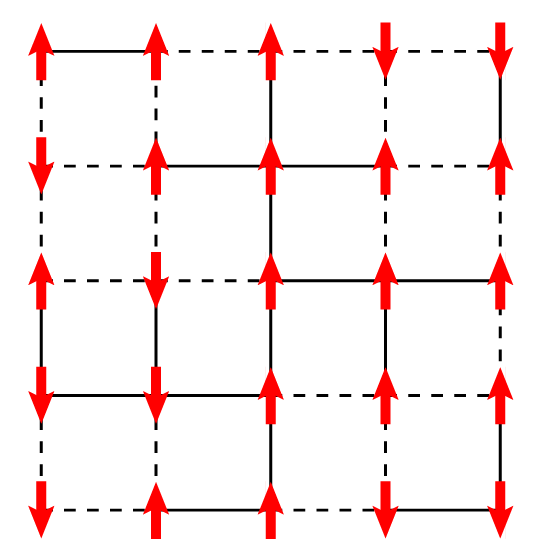
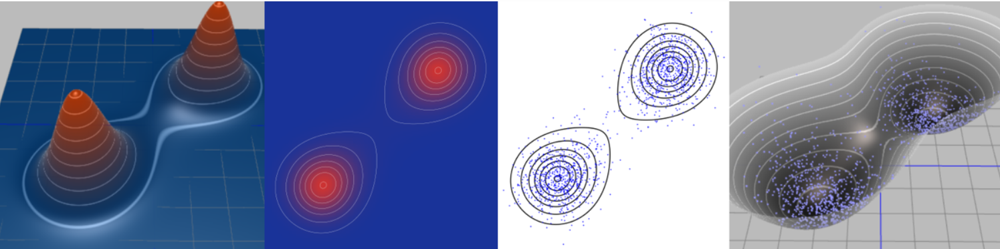

# Hopfield Network

# Spin Glass

## Ising Model

Spin glass model starts from Ising model to study the magnetic properties of ferromagnetic materials from a statistical mechanics perspective. The model is a simple lattice model, in the following picture is a 2D square lattice with $N=5\times 5$ sites. On each lattice site $i$ there is an atom, represented by a spin variable $s_i = \pm 1$ (red arrows pointing up or down). 

In statistical mechanics, to study the properties of a system, one needs to start from the energy function of states of a system. In the Ising model, we mainly focus on two components of the energy function: the interaction energy between spins, and the external magnetic field. The energy function of the Ising model is thus given by:

$$
\begin{aligned}
    E(s) = -\sum_{i,j}w_{ij}s_i s_j - h\sum_i s_i
\end{aligned}
$$ 
where $J_{ij}$ is the interaction strength between spins $i$ and $j$, and $h$ is the external magnetic field. In this case, technically speaking, once we know the values of $w_{ij}$ and $h$, we can have the exact solution of the model, but it turns out that when the model gets larger and larger, the exact solution becomes intractable. So in physics, we often apply some simplifications to the model, such as:

- **Mean-field Approximation**: each spin only 'feels' the average effect of all other spins;
- **Ising Model** on a regular lattice: we imagine the spins are on a regular lattice, and the interaction strength $w_{ij}$ only depends on the spacial relationship between spins $i$ and $j$. For example, in the above 2D square lattice, only neighboring spins interact with each other ($w_{ij}=w\neq 0$);
- **Sherrington-Kirkpatrick Model**: the interaction strength $w_{ij}$ is random, but following i.i.d. distribution (e.g. standard normal distribution, or uniform distribution).

But in our case, **Hopfield Network**, we use the most general form, the $w_{ij}$ matrix stores the *'memory'* of the network, and the (local) minima of the energy function are the *'memorized'* states. But as we stated before, the exact solution of the model is intractable, so some numerical methods are needed to solve the model. In this case we will find that the physical nature of the spin glass model provides lots of convenience.

### Statistical Mechanics, Boltzmann Distribution and Numerical Methods

In canonical ensemble, the probability of a state $s$ is given by the Boltzmann distribution:
$$
\begin{aligned}
    p(s) = \frac{1}{Z}e^{-\beta E(s)},\quad Z = \sum_s e^{-\beta E(s)}
\end{aligned}
$$ 
in which the normalization factor $Z$ is called the partition function, and $\beta = 1/k_BT$ is the inverse temperature. If you are really interested in how physicists derive this formula, you can refer to any statistical mechanics textbook, here we just take it as a fact. Since there is always thermal fluctuation in the system, the system will not stay in the state with the lowest energy, but will fluctuate around the equilibrium state, and Boltzmann distribution tells us *at equilibrium, the probability that a system stays in a state*.

Now if we examine the probability expression, we notice that when $\beta \to \infty$, i.e. when the temperature $T\to 0$, the probability of a state $s$ is dominated by the states with the lowest energy. That means, the system would tend to stay in the state with the lowest energy, especially at low temperature. 

To sample from the Boltzmann distribution, we have lots of methods, such as Metropolis-Hastings algorithm, Gibbs sampling, Hamiltonian Monte Carlo, etc. We are not going to detail these methods here, but it's strongly recommended to look at figures in [this blog](https://arogozhnikov.github.io/2016/12/19/markov_chain_monte_carlo.html) to see how the system *'tends to stay in the state with the lowest energy'*. Here's a figure from the blog, in which each point is a sampled state from the Boltzmann distribution, you can see more samples are around the state with low energy.

The basic idea of these sampling methods is to wisely build a Markov chain and use the stationary distribution as the target distribution. Further, we can slowly drop the temperature in the process of sampling so that we have higher and higher probability around low energy states. This trick is called *annealing*.

### From Hopfield Network to Boltzmann Machine

Now we have the basic idea of the Boltzmann distribution and the sampling methods, we can see that when we view the Hopfield network as thermal system, the energy function of the network is exactly the energy function of the Ising model, and **we can apply the sampling methods of Boltzmann distribution of the Ising model to find the low energy states of the hopfield network**. 

As we mentioned before, we want to train a Hopfield network so that it memorizes target patterns while avoiding spurious states. In the context of the Ising model, we can view it as maximizing the likelihood that the network stays in the memorized states, i.e. $w_{ij}, h_{i}$ are chosen such that: 

$$
\begin{aligned}
    w_{ij}, h_{i}=\mathop{\arg\min}\limits_{w,h} \sum_{s\in \mathcal{S}}\log\dfrac{ 1 }{ Z }e^{-\beta E(s)}  
\end{aligned}
$$ 

### Gradient Descent to Train Hopfield Network

we can get the solution by gradient descent, here we provide a brief derivation of the gradient. Denote the target function (the likelihood) as $\mathcal{L}(w,h)$, then the gradient of the target function is:
$$
\begin{aligned}
    \dfrac{\partial^{} \mathcal{L} }{\partial w^{} }=& \sum_{s\in \mathcal{S}}\dfrac{\partial^{} }{\partial w^{} }\log\dfrac{ 1 }{ Z }e^{\beta (s'ws+h's)}\\
    =& \sum_{s\in \mathcal{S}}\sum_{s\in \mathcal{S}}\dfrac{\partial^{} }{\partial w^{} }\beta (s'ws+h's) - \left\vert \mathcal{S} \right\vert \dfrac{\partial^{} \log Z }{\partial w^{} }\\
    =& \beta \sum_{s\in \mathcal{S}}ss' - \left\vert \mathcal{S} \right\vert \dfrac{\partial^{} \log Z }{\partial w^{} }\\
    \dfrac{\partial^{} \mathcal{L} }{\partial h^{} }=&\sum_{s\in \mathcal{S}}\dfrac{\partial^{} }{\partial h^{} }\log\dfrac{ 1 }{ Z }e^{\beta (s'ws+h's)}\\
    =& \sum_{s\in \mathcal{S}}\sum_{s\in \mathcal{S}}\dfrac{\partial^{} }{\partial h^{} }\beta (s'ws+h's) - \left\vert \mathcal{S} \right\vert \dfrac{\partial^{} \log Z }{\partial h^{} }\\
    =& \beta \sum_{s\in \mathcal{S}}s - \left\vert \mathcal{S} \right\vert \dfrac{\partial^{} \log Z }{\partial h^{} }
\end{aligned}
$$ 
and we notice that for partition function $Z$, we have:
$$
\begin{aligned}
    \dfrac{\partial^{} \log Z }{\partial w^{} } =& \dfrac{ 1 }{ Z } \dfrac{\partial^{} Z }{\partial w^{} }\\
    =& \dfrac{ 1 }{ Z } \sum_{s}\dfrac{\partial^{} }{\partial w^{} }e^{\beta (s'ws+h's)}\\
    =& \dfrac{ 1 }{ Z } \sum_{s} \beta ss' e^{\beta (s'ws+h's)}\\
    =& \beta \sum_{s}p(s)ss' := \beta \langle ss' \rangle\\
    \dfrac{\partial^{} \log Z }{\partial h^{} }=&  \dfrac{ 1 }{ Z } \dfrac{\partial^{} Z }{\partial h^{} }\\
    =& \dfrac{ 1 }{ Z } \sum_{s}\dfrac{\partial^{} }{\partial h^{} }e^{\beta (s'ws+h's)}\\
    =& \dfrac{ 1 }{ Z } \sum_{s} \beta s e^{\beta (s'ws+h's)}\\
    =& \beta \sum_{s}p(s)s := \beta \langle s \rangle
\end{aligned}
$$ 
in which $\langle \, \cdot \, \rangle$ is the *average over thermal equilibrium*, which can be easily approximated by Monte Carlo sampling. Thus we have
$$
\begin{aligned}
    \dfrac{\partial^{} \mathcal{L} }{\partial w^{} }= & \beta \sum_{s\in \mathcal{S}}ss' - \left\vert \mathcal{S} \right\vert \beta \langle ss' \rangle\\
    \dfrac{\partial^{} \mathcal{L} }{\partial h^{} }= & \beta \sum_{s\in \mathcal{S}}s - \left\vert \mathcal{S} \right\vert \beta \langle s \rangle
\end{aligned}
$$ 
and we update the hopfield network parameters by:
$$
\begin{aligned}
    w \leftarrow w + \eta \dfrac{\partial^{} \mathcal{L} }{\partial w^{} }\\
    h \leftarrow h + \eta \dfrac{\partial^{} \mathcal{L} }{\partial h^{} }
\end{aligned}
$$ 